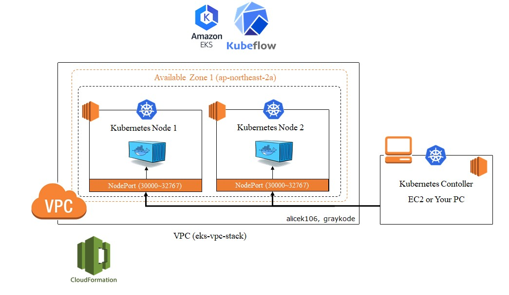
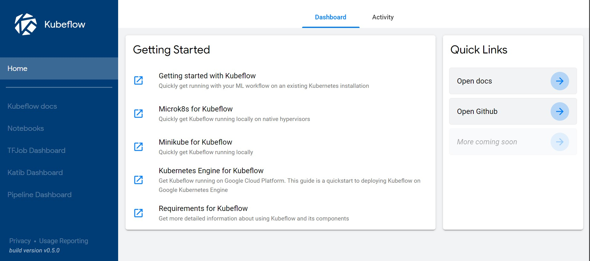
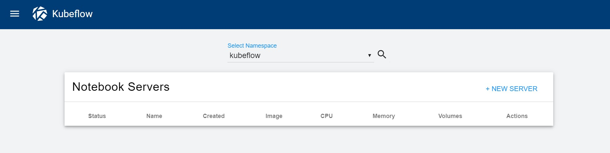
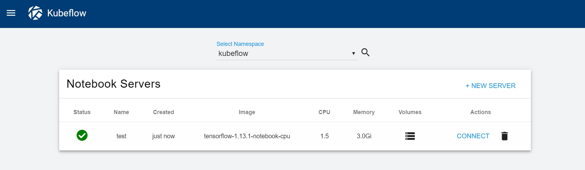
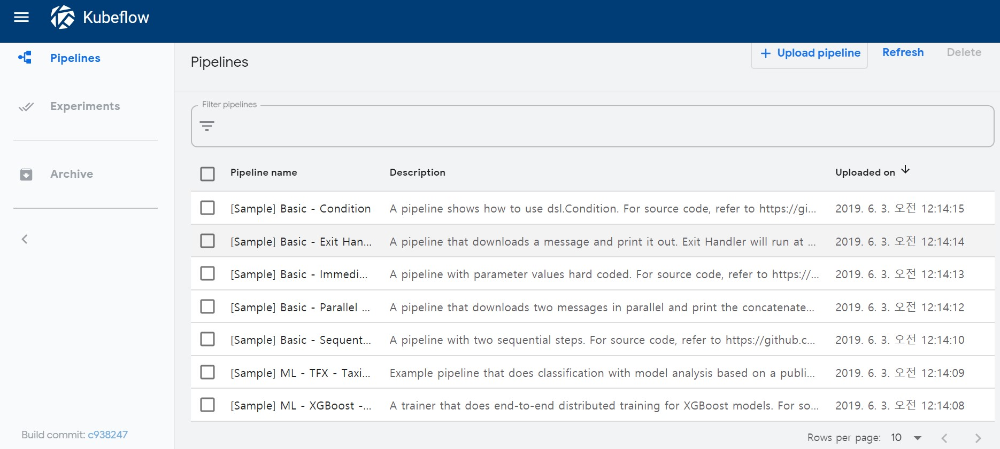
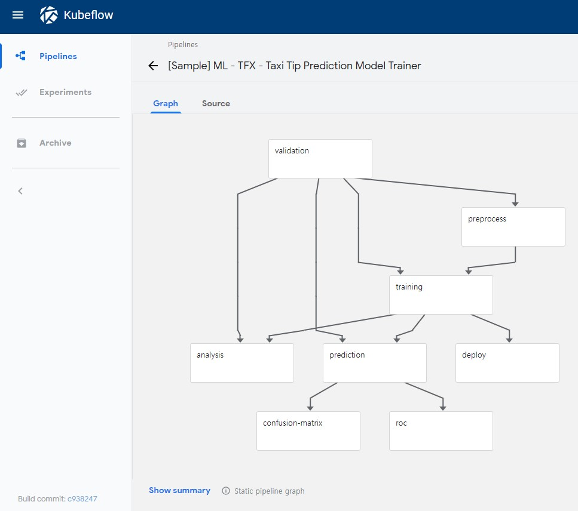
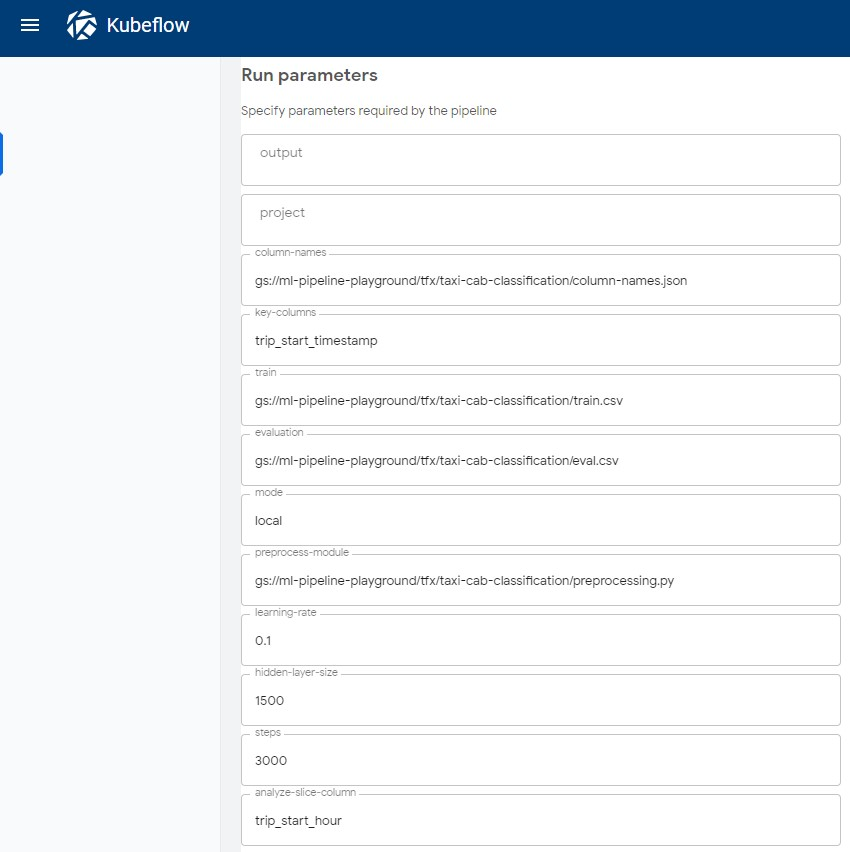

## AWS-Kubeflow

<p align="center">  </p>

`AWS-Kubeflow` is a guideline for basic use and installation of kubeflow in AWS.

##### What is kubeflow?

Kubeflow is a Cloud Native platform for machine learning based on Google’s internal machine learning pipelines. [Quickly get running with your ML Workflow](<https://www.kubeflow.org/docs/about/kubeflow/>)

> The Kubeflow project is dedicated to making deployments of machine learning (ML) workflows on Kubernetes simple, portable and scalable. Our goal is not to recreate other services, but to provide a straightforward way to deploy best-of-breed open-source systems for ML to diverse infrastructures. Anywhere you are running Kubernetes, you should be able to run Kubeflow.


## Architecture
<p align="center"></p>

#### Introduce about Requirement for kubeflow

- [eksctl](https://github.com/weaveworks/eksctl) : is a simple CLI tool for creating clusters on EKS - Amazon's new managed Kubernetes service for EC2. It is written in Go, and uses CloudFormation.
- [kubectl](<https://github.com/kubernetes/kubectl>) : The Kubernetes command-line tool.
- [aws-cli]() : AWS Command Line Interface.
- aws-iam-authenticator
- [ksonnet](<https://github.com/ksonnet/ksonnet>) : A CLI-supported framework that streamlines writing and deployment of Kubernetes configurations to multiple clusters. 
- [jq](<https://stedolan.github.io/jq/download/>) : jq is a lightweight and flexible command-line JSON processor.


## Install Kubeflow(v0.5.0)

Start with a Ubuntu 16.04 `EC2` for `kubernetes controller` **Should >= c4.xlarge (7.5GB Memory, 20GB >= Storage), Open All TCP Port Inbound for test**.

I recommend `EC2` than docker container, because it is more easy to tunneling with DashBoard.

Connect to your EC2.

1. Install requirements

```shell
$ sudo su

$ apt update && \
  apt install python python-pip curl groff vim jq gzip git -y
  
# install kubectl
$ curl -o kubectl https://amazon-eks.s3-us-west-2.amazonaws.com/1.11.5/2018-12-06/bin/linux/amd64/kubectl && \
  chmod +x kubectl && \
  mv kubectl /usr/bin/

# kubectl version check
$ kubectl version
Client Version: version.Info{Major:"1", Minor:"11", GitVersion:"v1.11.5", GitCommit:"753b2dbc622f5cc417845f0ff8a77f539a4213ea", GitTreeState:"clean", BuildDate:"2018-12-06T01:33:57Z", GoVersion:"go1.10.3", Compiler:"gc", Platform:"linux/amd64"}


# install aws-iam-authenticator
$ curl -o aws-iam-authenticator https://amazon-eks.s3-us-west-2.amazonaws.com/1.11.5/2018-12-06/bin/linux/amd64/aws-iam-authenticator && \
  chmod +x aws-iam-authenticator && \
  mv aws-iam-authenticator /usr/bin/
  
  
# install awscli
$ pip install awscli --upgrade

# awscli version check
$ aws --version
aws-cli/1.16.169 Python/2.7.12 Linux/4.4.0-1083-aws botocore/1.12.159


# install eksctl
$ curl --silent --location "https://github.com/weaveworks/eksctl/releases/download/latest_release/eksctl_$(uname -s)_amd64.tar.gz" | tar xz -C /tmp && \
  mv /tmp/eksctl /usr/local/bin
  
# eksctl version check
$ eksctl version
[ℹ]  version.Info{BuiltAt:"", GitCommit:"", GitTag:"0.1.33"}
```


2. AWS IAM key environment variable registration

```shell
$ export AWS_ACCESS_KEY_ID=<KEY>
$ export AWS_SECRET_ACCESS_KEY=<KEY>
```


3. Elastic Kubernetes Clustering using `eksctl`

```shell
# create cluster
$ eksctl create cluster eks-cpu \
--node-type=c4.xlarge \
--timeout=40m \
--nodes=2 \
--region=ap-northeast-2
```

- You should make node >= c4.xlarge.
- `--node-type`, `--region`, `--nodes` : select node-type, region, number of nodes.
- It takes a lot of time to make, so drink coffee. :coffee:
- `eksctl` will setting availability zones, subnets, make nodegroup with EC2 instances, Auto Scaling Group and  Elastic Kubernetes Cluster(EKS), etc.


4. When the `eks` are complete, check the node using the following command:

```shell
$ kubectl get nodes "-o=custom-columns=NAME:.metadata.name,MEMORY:.status.allocatable.memory,CPU:.status.allocatable.cpu,GPU:.status.allocatable.nvidia\.com/gpu"
NAME                                                MEMORY      CPU       GPU
ip-192-168-12-60.ap-northeast-2.compute.internal    7548168Ki   4         <none>
ip-192-168-55-153.ap-northeast-2.compute.internal   7548172Ki   4         <none>
```


5. (Option) If you used GPU instances

```shell
$ kubectl apply -f https://raw.githubusercontent.com/NVIDIA/k8s-device-plugin/v1.11/nvidia-device-plugin.yml
```


6. Install ksonnet

```shell
# install ksonnet
$ wget https://github.com/ksonnet/ksonnet/releases/download/v0.13.1/ks_0.13.1_linux_amd64.tar.gz && \
   tar -xvf ks_0.13.1_linux_amd64.tar.gz && \
   mv ks_0.13.1_linux_amd64/ks /usr/local/bin

# ksonnet version check
# ksonnet had ended in github, lastest version is 0.13.1
$ ks version
ksonnet version: 0.13.1
jsonnet version: v0.11.2
client-go version: kubernetes-1.10.4
```


#### Install Kubeflow

7. Run the following commands to download the latest [kfctl.sh](http://kfctl.sh/)

```shell
$ export KUBEFLOW_SRC=/tmp/kubeflow-aws
$ export KUBEFLOW_VERSION=v0.5-branch

$ mkdir -p ${KUBEFLOW_SRC} && cd ${KUBEFLOW_SRC}
$ curl https://raw.githubusercontent.com/graykode/aws-kubeflow/master/kubeflow.sh | bash

$ curl -O https://raw.githubusercontent.com/graykode/aws-kubeflow/master/util.sh && \
   mv util.sh ${KUBEFLOW_SRC}/scripts/aws/util.sh
```


8. We should follow [Initial cluster setup for existing cluster](<https://www.kubeflow.org/docs/aws/deploy/existing-cluster/>) document.

```shell
$ export KFAPP=kfapp
$ export REGION=ap-northeast-2
$ export AWS_CLUSTER_NAME=eks-cpu

# check your nodegroup role name
$ aws iam list-roles \
    | jq -r ".Roles[] \
    | select(.RoleName \
    | startswith(\"eksctl-$AWS_CLUSTER_NAME\") and contains(\"NodeInstanceRole\")) \
    .RoleName"
    
eksctl-eks-cpu-nodegroup-ng-11598-NodeInstanceRole-S6OPLB7TW3RR

$ export AWS_NODEGROUP_ROLE_NAMES=eksctl-eks-cpu-nodegroup-ng-11598-NodeInstanceRole-S6OPLB7TW3RR
```


9. kfctl.sh init

```shell
$ cd ${KUBEFLOW_SRC}
$ ${KUBEFLOW_SRC}/scripts/kfctl.sh init ${KFAPP} --platform aws \
--awsClusterName ${AWS_CLUSTER_NAME} \
--awsRegion ${AWS_REGION} \
--awsNodegroupRoleNames ${AWS_NODEGROUP_ROLE_NAMES}

$ ls
deployment  kfapp  kubeflow  scripts
```


10. Generate and apply the Kubernetes changes.

```shell
$ cd ${KFAPP}

# Generate the Kubernetes changes.
$ ${KUBEFLOW_SRC}/scripts/kfctl.sh generate k8s

# deploly changed kubernetes.
$ ${KUBEFLOW_SRC}/scripts/kfctl.sh apply k8s
```

Finished install kuberflow!!! :heart_eyes:


Check namespace kubeflow pods. Waiting all pods Running finish.

```shell
$ kubectl get pods -n kubeflow
```


##### Tips. When delete kubeflow using kfctl.sh

`${KUBEFLOW_SRC}/scripts/kfctl.sh delete k8s`


#### Good Tips. Re-connected EKS

If you would like re-connected EKS(such as reconnected ssh terminal), fellow this.

```shell
$ sudo su
$ cd /tmp

$ export AWS_ACCESS_KEY_ID=<KEY>
$ export AWS_SECRET_ACCESS_KEY=<KEY>
$ aws eks --region ap-northeast-2 update-kubeconfig --name eks-cpu

# check kubernetes cluster
$ kubectl get nodes
```


## Start Kubeflow DashBoard

```shell
$ kubectl port-forward -n kubeflow `kubectl get pods -n kubeflow --selector=service=ambassador -o jsonpath='{.items[0].metadata.name}'` 8080:80

# !! ssh tunneling using another terminal
$ ssh -i your_key.pem ubuntu@server-ip -L 8080:localhost:8080
```

Enter to [http://127.0.0.1:8080](http://127.0.0.1:8080/).




#### Tips. (Option) Start [Kubernetes Dashboard](<https://docs.aws.amazon.com/eks/latest/userguide/dashboard-tutorial.html>)

```shell
# Deploy Kubernetes DashBoard
$ kubectl apply -f https://raw.githubusercontent.com/kubernetes/dashboard/v1.10.1/src/deploy/recommended/kubernetes-dashboard.yaml

# Deploy the heapster to monitor the container cluster and enable performance analysis of the cluster.
$ kubectl apply -f https://raw.githubusercontent.com/kubernetes/heapster/master/deploy/kube-config/influxdb/heapster.yaml

# Deploy an influxdb backend to the cluster for the heapster
$ kubectl apply -f https://raw.githubusercontent.com/kubernetes/heapster/master/deploy/kube-config/influxdb/influxdb.yaml

# Create Heapster Cluster Role Bindings for Dashboards
$ kubectl apply -f https://raw.githubusercontent.com/kubernetes/heapster/master/deploy/kube-config/rbac/heapster-rbac.yaml

# Create eks-admin service account and cluster role binding
$ kubectl apply -f https://raw.githubusercontent.com/graykode/aws-kubeflow/master/eks-admin-service-account.yaml

```


```shell
# interlock Dashboard
$ kubectl -n kube-system describe secret $(kubectl -n kube-system get secret | grep eks-admin | awk '{print $1}')
```

Write token string to login Kubernetes Dashboard.


```shell
# start Dashboard
$ kubectl proxy

# !! ssh tunneling using another terminal
$ ssh -i your_key.pem ubuntu@server-ip -L 8001:localhost:8001
```

Enter to <http://localhost:8001/api/v1/namespaces/kube-system/services/https:kubernetes-dashboard:/proxy/#!/login>.


## Run Example in [kubeflow/example](<https://github.com/kubeflow/examples>)

### [github_issue_summarization](https://github.com/kubeflow/examples/tree/master/github_issue_summarization)


#### 1. [NoteBook](https://github.com/kubeflow/examples/blob/master/github_issue_summarization/02_training_the_model.md)

You can use kubeflow such as **google colaboratory**, Machine Learning Engineer don't know the cloud infrastructure, but they only need to use Jupyter notebook.

1. Enter [NoteBooks](<http://127.0.0.1:8080/_/notebooks>) Tab.



2. New Server: name with `test`. And Connect to Jupyter Notbook.



See `kubectl get pods -n kubetl`

```shell
NAME                                                        READY     STATUS    RESTARTS   AGE
..
test-0                                                      1/1       Running   0          15m
..
```

3. News > Terminal

```shell
$ git clone https://github.com/kubeflow/examples

# install pip package
$ pip install pandas sklearn ktext matplotlib annoy nltk pydot

$ wget https://raw.githubusercontent.com/graykode/aws-kubeflow/master/Training.ipynb && \
   mv Training.ipynb examples/github_issue_summarization/notebooks
```

4. Run [Training.ipynb](<http://127.0.0.1:8080/notebook/kubeflow/test/notebooks/examples/github_issue_summarization/notebooks/Training.ipynb#>)


#### 2. [Training the model using TFJob](https://github.com/kubeflow/examples/blob/master/github_issue_summarization/02_training_the_model_tfjob.md)

- TODO

#### 3. [Distributed Training using estimator and TFJob]() 

- TODO


### [Pipeline-dashboard](<http://127.0.0.1:8080/_/pipeline-dashboard>)




1. Use [Sample] ML - TFX - Taxi Tip Prediction Model Trainer




2. Set parameter Setting and run.




#### TODO

I will add more example after getting used to kuberflow! 🔨🔨


## Don't Miss delete eks Cluster after used!!!!

```shell
$ eksctl delete cluster --name eks-cpu --region ap-northeast-2
```


## Author

- Tae Hwan Jung(Jeff Jung) @graykode
- Author Email : [nlkey2022@gmail.com](mailto:nlkey2022@gmail.com)


## Reference

- [Install Kubeflow](https://www.kubeflow.org/docs/aws/deploy/install-kubeflow/)
- [Initial cluster setup for existing cluster](https://www.kubeflow.org/docs/aws/deploy/existing-cluster/)
- [kubeflow/examples](<https://github.com/kubeflow/examples/tree/master/github_issue_summarization>)
- [alicek106 / aws-cli-preset](https://github.com/alicek106/aws-cli-preset)
- https://swalloow.github.io/eks-kubeflow

